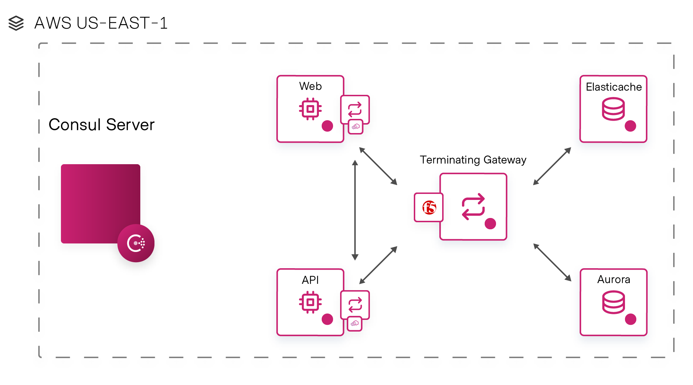

# Big-IP Terminating Gateway
The Big-IP Terminating Gateway enables services within a Hashicorp Consul Connect mesh to reach outside that mesh for existing traditional applications or SaaS services in a way that automates the provisioning and security.

## Overview
As part of digital transformation strategy, an increasing number of enterprises are embracing containers for their green field applications. Naturally, modernizing their existing applications is also part of this strategy. Due to various reasons such as complexity and cost, enterprises end up having applications spanning on multiple platforms such as bare metal, virtual machines, or containers. A service mesh solution such as Consul Connect is typically deployed to ensure intelligent communications between services running on disparate environments. Sometimes, services under a mesh will need to communicate securely with an external service. Enter terminating gateways.

### Hashicorp Consul Connect
[Consul Connect](https://www.consul.io/use-cases/multi-platform-service-mesh) is a service mesh that provides service-to-service connection authorization and encryption using mutual Transport Layer Security (mTLS). Applications can use sidecar proxies in a service mesh configuration to establish TLS connections for inbound and outbound connections without being aware of Connect at all.

### Terminating Gateway
[Terminating Gateway](https://www.consul.io/docs/connect/gateways/terminating-gateway) provides mutual TLS encryption and authentication, service level ACLs (Intentions), and request routing.

### BIG-IP AS3
[AS3](https://clouddocs.f5.com/products/extensions/f5-appsvcs-extension/latest/) is used to configure the BIG-IP for the Terminating Gateway usecase.  It provides a delarative API that makes configuring the BIG-IP easy and consistent.


---

## Usage

### Requirements
 - F5 Big-IP version 14.1.x+
 - F5 Application Services 3 Extension (AS3) v3.20.0+
 - Hashicorp Consul 1.8.0+

### Configure
Configuration file types supported: toml, hcl, yaml, or json.
The file must be named "config", with the appropriate file extention for a given format.
It must be present in the directory where bigip-tgw is run. Below are the supported configuration parameters:

Gateway:
  - Name: string (name of terminating gateway and corresponding BIG-IP virtual server, required)

Consul:
  - Address: string (URL for Consul server with scheme and port, required)
  - Token: string (ACL token for Consul authentication, optional)

BIGIP:
  - BIGIPURL: string (URL for BIGIP admin interface with scheme and port, required)
  - BIGIPUSER: string (admin user for BIGIP authentication, required)
  - BIGIPPASSWORD: string (admin password for BIGIP authentication, required)
  - AS3PostDelay: int (minimum number of seconds of delay between AS3 posts in order to rate limit requests, required)
  - SSLInsecure: bool (trust insecure certificates on the BIGIP, optional)

Example Configuration File:
config.toml
```toml
[gateway]
  	name = "gateway_name"
[bigip]
	bigipurl = "https://127.0.0.1:8443"
	bigipuser = "admin"
	bigippassword = "password"
	as3postdelay = 5
	sslinsecure = true
[consul]
	address = "http://127.0.0.1:8500"
```

Configuration can also be passed via environment variables:
 - GATEWAY_NAME
 - BIGIP_BIGIPURL
 - BIGIP_BIGIPUSER
 - BIGIP_BIGIPPASSWORD
 - CONSUL_ADDRESS

Run:
```bash
  ./bigip-tgw
```
In order to remove the BIG-IP partition and all BIG-IP configuration created by this service:
```bash
  ./bigip-tgw remove
```
### Docker Usage
A simple Dockerfile is provided.  An empty configuration file is created in the docker image so that all configuration can be passed via environment variables.
```bash
  docker build -t bigip-tgw .
  docker run -e GATEWAY_NAME=gateway_name -e BIGIP_BIGIPURL=127.0.0.1 -e BIGIP_BIGIPUSER=admin -e BIGIP_BIGIPPASSWORD=password -e CONSUL_ADDRESS=127.0.0.1:8500 bigip-tgw
```

## Support
For support, please open a GitHub issue.  Note, the code in this repository is community supported and is not supported by F5 Networks.  For a complete list of supported projects please reference [SUPPORT.md](support.md).

## Community Code of Conduct
Please refer to the [F5 DevCentral Community Code of Conduct](code_of_conduct.md).


## License
[Apache License 2.0](LICENSE)

## Copyright
Copyright 2014-2020 F5 Networks Inc.


### F5 Networks Contributor License Agreement

Before you start contributing to any project sponsored by F5 Networks, Inc. (F5) on GitHub, you will need to sign a Contributor License Agreement (CLA).

If you are signing as an individual, we recommend that you talk to your employer (if applicable) before signing the CLA since some employment agreements may have restrictions on your contributions to other projects.
Otherwise by submitting a CLA you represent that you are legally entitled to grant the licenses recited therein.

If your employer has rights to intellectual property that you create, such as your contributions, you represent that you have received permission to make contributions on behalf of that employer, that your employer has waived such rights for your contributions, or that your employer has executed a separate CLA with F5.

If you are signing on behalf of a company, you represent that you are legally entitled to grant the license recited therein.
You represent further that each employee of the entity that submits contributions is authorized to submit such contributions on behalf of the entity pursuant to the CLA.